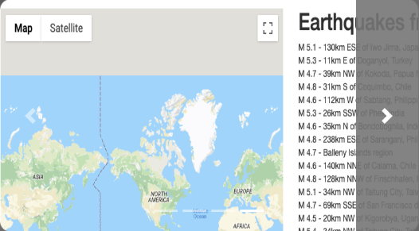
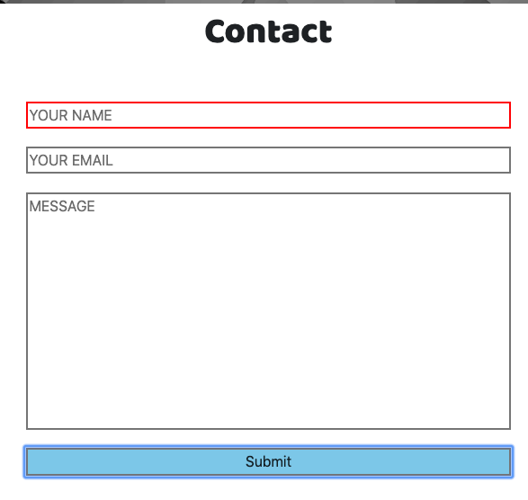
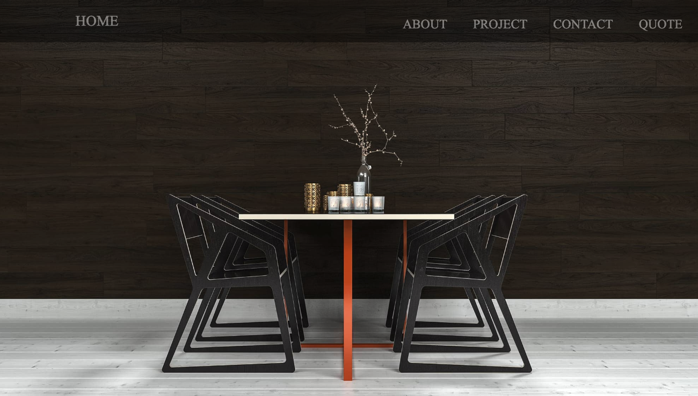
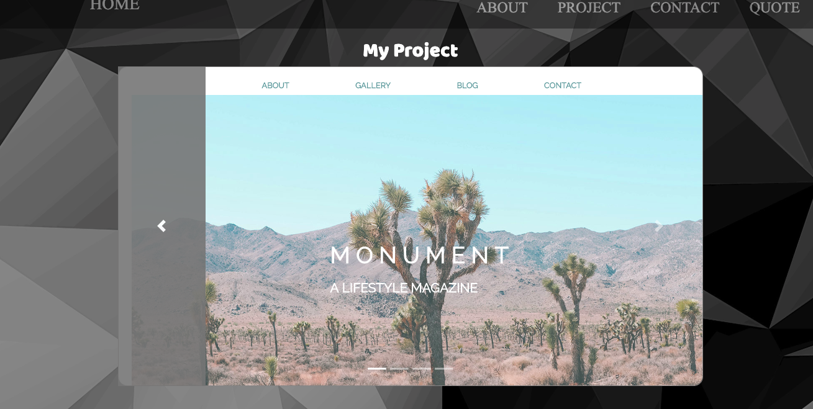
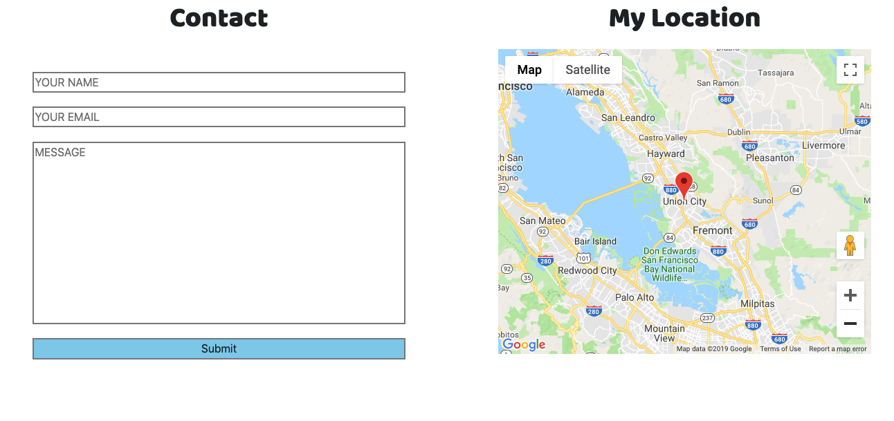

# Project for building an About Me Site

#### Overview

This project I have create is based on what I have learned in the past 3 weeks of my coding skill and make it as an Personal Page. Technology I have used are HTML/CSS/JAVASCRIPT, which are the past three weeks that I have been training on. 

---

#### Requirement for this project

Below are the requirement checkbox which I will need to use to accomplish this project.

- [x] Use semantic markup for HTML and CSS, adhering to best practices.
- [x] Use Flexbox/Grid to create a multi-column layout.
- [x] Be completely responsive.
- [x] Include separate HTML/CSS/JavaScript files.
- [x] Stick with the KISS (Keep It Simple Stupid) and DRY (Don't Repeat Yourself) principles.
- [x] Use JavaScript or jQuery for DOM manipulation.
- [x] Be deployed and accessible online.

---

#### My Process or Approach 
My process through this whole project is using HTML/CSS/JAVASCRIPT and BOOTSTRAP for the whole project to create it's design and functionality. The deliverable for this project is to let user to have a better experience on working to look over my Personal Website. For the project, I have used many source and knowledge I have learn from my GA class and thanks to my instructor, I have been able to create such an creative website. 

---

#### Unsolved Problem
Since I have tried my best on creating this website, this website still have many bugs and problem that are difficult to solve on the limited time that this project need to be finished. 

 - Carousel Image- I have spend very long on modifying the images inside the Carousel that I have taken from BootStrap, but there are some stuff that I can or cannot modify from it. I cannot modify the image that have been pust inside the Carousel when I minimize the screen small from using Media Queries. There might be a way, but I have tried a long time which I run out of luck and ideas 
 

 - required field for Email- I have encounter problems like there are required field for Name and Emails. If one of them are not filled, it will not submit and the border will turn red. But my code only work for the Name, not the email, or another way around is only email not the name if I change the code around. I will try to improve this in the future on my spare time. 

 

---

#### Bigest Wins and Challenge. Deliverables

Creating the whole website are Challenging. Flexbox and Grid are very Challegening and it feel very good to overcome this challenge. I spend a lot of time to organize the flex box and at last, when I really overcome how this function, it really feels good! 

APIs- I have made an API google map on my page. The Map is not really difficult or challenging to put in the website, but as an backend lover, this accomplishment felt good also. Not a big challenge, but a huge satisfication.

#### Deliverables. Below are my Deliverables for my Website.

First Page-which is the Home Page

About Me- Brief Explanation about my self

Project- Project or lab which I have accomplish the last 3 weeks

Contact Page- Page for User Feedback or Contact info

Quoting- Quote and testimonial from what other people comment on me.

